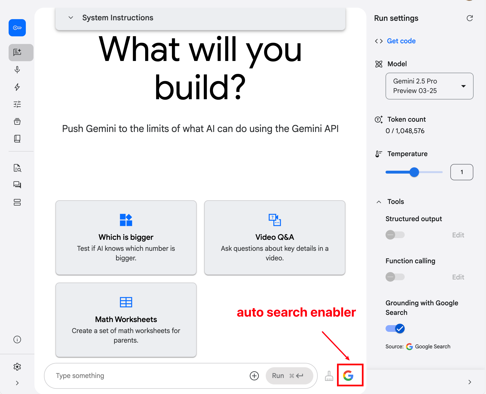
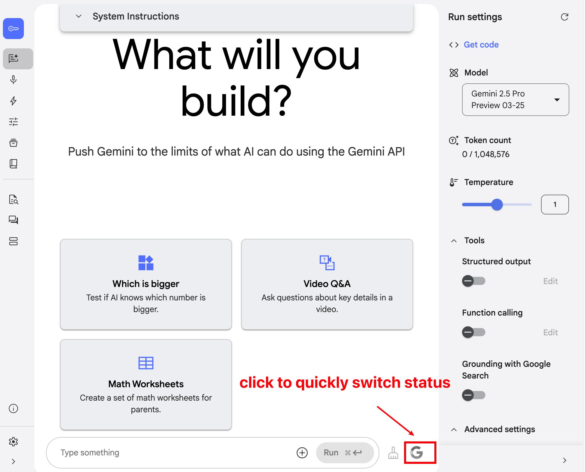

# AI Studio Auto Google Search Enabler

[ <b>En</b> |
<a href="docs/README_CN.md">中</a> |
<b>A simple Chrome extension designed to enhance the user experience on Google AI Studio.</b>

## Demo Video

<video src="./videos/demo.mp4" controls>
  您的浏览器不支持 HTML 视频。
</video>

## Extension UI

## The Problem 🤔

The Gemini models within Google AI Studio can provide more up-to-date answers by enabling the "Grounding with Google Search" option, which fetches the latest information from the web. However, AI Studio has an inconvenient behavior:

1.  This option is disabled by default.
2.  Users need to manually re-enable this option *every time* they start a new conversation, as it doesn't remember the setting.

This is tedious and easy to forget for users who want their AI responses consistently grounded in the latest information.

## The Solution ✨

This Chrome extension automates this task for you!

When you visit aistudio.google.com and are about to start or continue a conversation, this extension automatically detects and ensures that the "Grounding with Google Search" toggle (usually a checkbox or switch) is **enabled**.

## Features ⭐

*   **Automatic Enablement:** Automatically checks the Google Search grounding option without any manual intervention.
*   **Seamless Integration:** Works silently in the background after installation, not disrupting your workflow.
*   **Improved Efficiency:** Saves you the hassle of manually enabling the switch for every new conversation, letting you focus on interacting with the AI.
*   **Ensured Timeliness:** Helps ensure your AI Studio conversations leverage the latest web information whenever possible.

## Installation 🚀

**Method 1: Via Chrome Web Store (Recommended)**

[Link to your Chrome Web Store listing will go here]

**Method 2: Manual Loading (Developer Mode)**

1.  Download or clone this repository to your local machine.
2.  Open Google Chrome, type `chrome://extensions` in the address bar, and press Enter.
3.  Enable the "Developer mode" toggle, usually found in the top-right corner.
4.  Click the "Load unpacked" button, typically located in the top-left.
5.  Select the folder where you downloaded or cloned the code.
6.  The extension icon should appear in your browser's toolbar, indicating successful installation.

## How It Works 🛠️

The extension monitors the loading and changes on the aistudio.google.com page. When it detects the relevant Google Search switch element exists and is not checked, it automatically triggers a click event to enable it.

## Contributing ❤️

Feel free to submit issues or pull requests to improve this extension!

## Build
**use build script(for local debug)**
1. run `npm run build`.
2. you will get `extension.zip` under dist folder.

## License 📄

This project is licensed under the [Apache License](LICENSE).