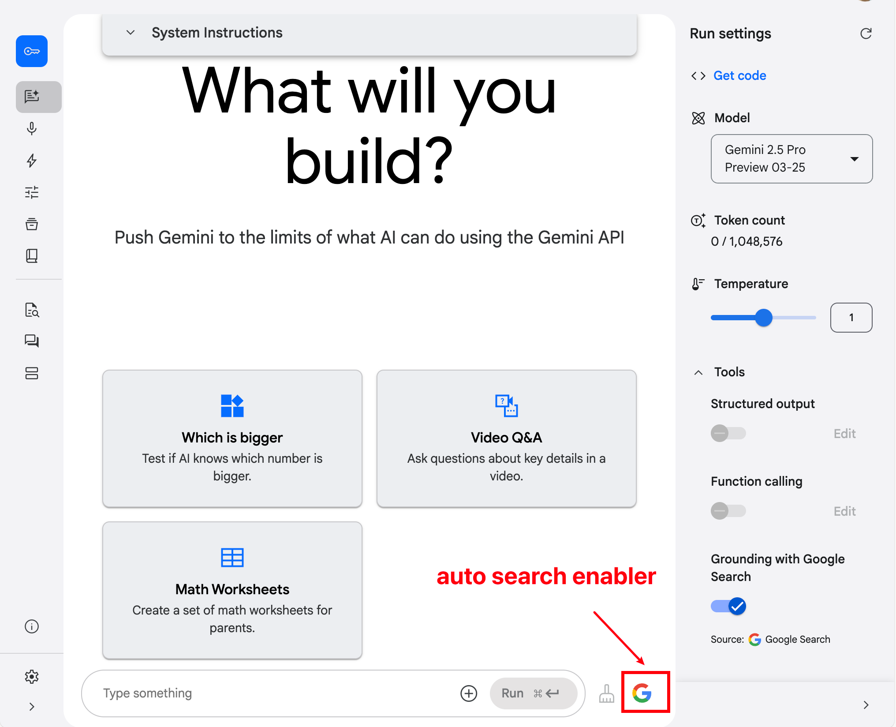
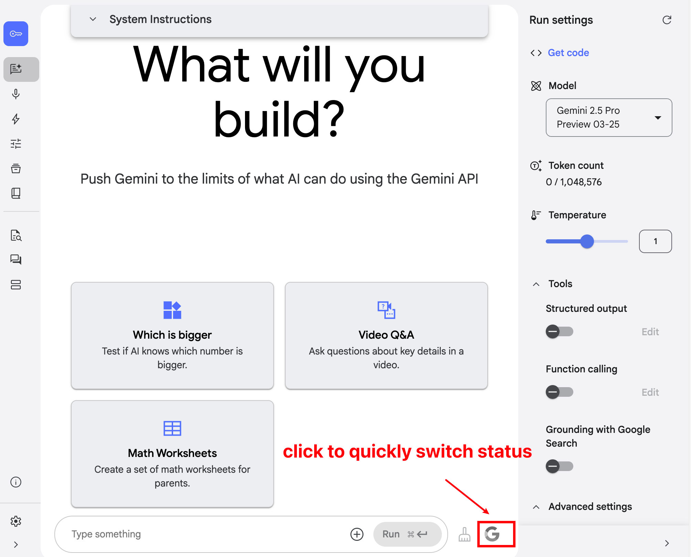

# AI Studio 谷歌搜索自动启用插件 | AI Studio Auto Google Search Enabler

[ <b>En</b> |
<a href="docs/README_CN.md">中</a> |
<b>一个简单的 Chrome 浏览器插件，旨在提升 Google AI Studio 的使用体验。</b>

## 插件 UI

## 痛点 🤔

Google AI Studio 中的 Gemini 模型可以通过启用 "Grounding with Google Search" 选项来获取最新的网络信息，从而提供更具时效性的回答。然而，AI Studio 存在一个不便之处：

1.  该选项默认是关闭的。
2.  每次开启新的对话 (Conversation) 时，都需要用户手动重新勾选该选项，它没有记忆功能。

这对于希望 AI 回答始终基于最新信息的用户来说，非常繁琐且容易忘记。

## 解决方案 ✨

本插件可以自动为你完成这项操作！

当你访问 aistudio.google.com 并准备开始或继续对话时，此插件会自动检测并确保 "Grounding with Google Search" 的开关（通常表现为一个复选框或开关按钮）处于**开启**状态。

## 功能 ⭐

*   **自动启用:** 无需任何手动操作，插件会自动勾选 Google Search 接地选项。
*   **无缝集成:** 安装后即可在后台静默工作，不打扰你的使用流程。
*   **提升效率:** 省去每次新建对话都要手动开启的麻烦，让你专注于与 AI 的交互。
*   **保证时效:** 确保你的 AI Studio 对话尽可能利用最新的网络信息。

## 安装 🚀

**方式一：通过 Chrome 应用商店 (推荐)**

[未来添加你的 Chrome 应用商店链接]

**方式二：手动加载 (开发者模式)**

1.  下载或克隆本仓库代码到本地。
2.  打开 Chrome 浏览器，地址栏输入 `chrome://extensions` 并回车。
3.  在页面右上角，打开 "开发者模式" (Developer mode) 开关。
4.  点击左上角的 "加载已解压的扩展程序" (Load unpacked) 按钮。
5.  选择你刚刚下载或克隆的代码文件夹。
6.  插件图标将出现在浏览器工具栏中，表示安装成功。

## 如何工作 🛠️

插件会监听 aistudio.google.com 页面的加载和变化。当检测到相关的 Google Search 开关元素存在且未被选中时，会自动触发一次点击操作，将其启用。

## 贡献 ❤️

欢迎提交 Issue 或 Pull Request 来改进这个插件！

## 许可证 📄

本项目采用 [Apache License](LICENSE)。